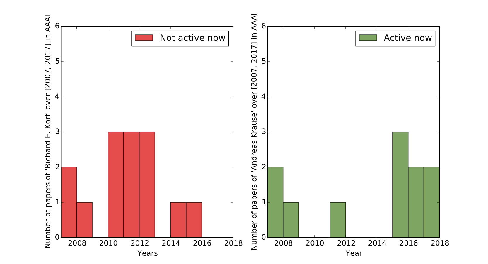
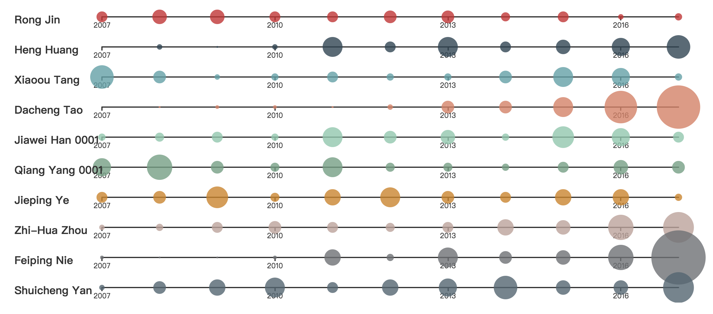
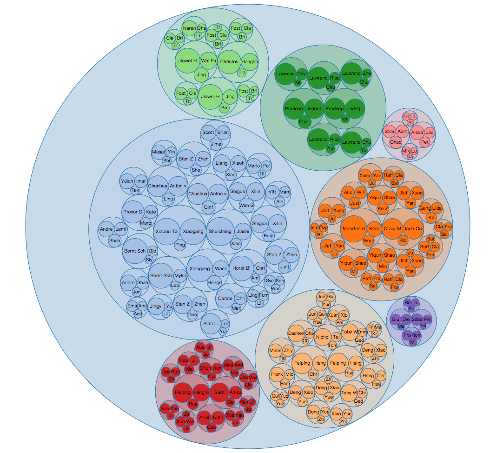
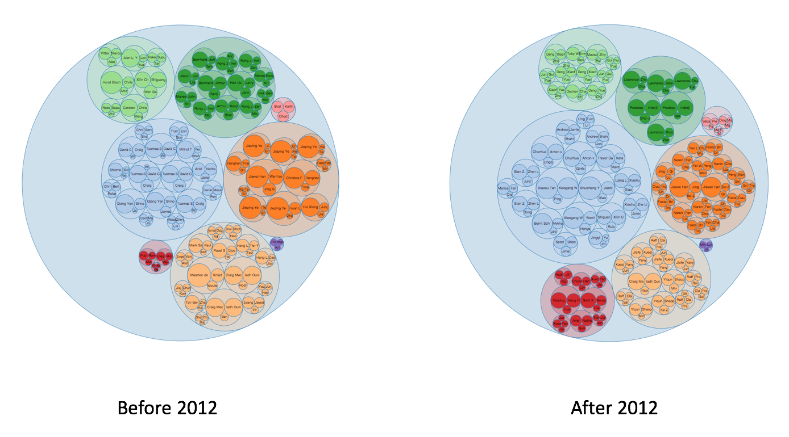

#### 机器学习第三次作业

> 小组：19
>
> 组员：xxxx
>


##### 任务 1

> - **任务1.1**
>
> 每一个会议都有各自的支持者，现在请你将每个会议各自的研究者寻找出来，并且根据时间信息，看看哪些人依然活跃，哪些人不再活跃。

> **实现**
>
> - 数据预处理
>
> > 通过遍历整个论文数据库数据文件，在原始文件中选择出 IJCAI, AAAI, COLT, CVPR, NIPS, KR, SIGIR, SIGKDD这八个会议的论文数据，并从中提取：
> >
> > > 1. 作者信息;
> > > 2. 论文标题信息;
> > > 3. 论文发表年份信息;
> > > 4. 会议名称;
> >
> > 共四个主要特征，制作成一个csv格式文件。（其中，多个作者之间使用'_'作为分割符）每篇论文作为数据表中的一行。
>
> - 数据统计：之后需要做的是按照不同的会议分类，统计出每个作者在该会议下，不同年份发表的论文分布情况。
>
> > 例如在AAAI会下，  Adnan Darwiche在2007~2017年发表论文的分布如下：
> >
> > | author         | 2007 | 2008  | 2009 | 2010 | 2011 |
> > | -------------- | ---- | ----- | ---- | ---- | ---- |
> > | Adnan Darwiche | 0    | 5     | 0    | 1    | 0    |
> > | author         | 2012 | 2013  | 2014 | 2015 | 2016 |
> > | Adnan Darwiche | 1    | 1     | 0    | 2    |      |
> > | author         | 2017 | Total |      |      |      |
> > | Adnan Darwiche | 0    | 12    |      |      |      |
>
> > 有了这个统计信息，我们就可以分析这个作者是否近年来还活跃在这个会议中。
>
> - 有几个比较直观的想法：
>
> > 1. 统计每位作者在该会议中峰值发表年份与2017年的差值
> > 2. 统计每位作者在该会议中近三年的发表数量
> > 3. 统计每位作者在该会议中近三年的发表数量占总发表数量的比值
>
> > 前两个衡量标准容易受到数据扰动的影响，经过试验，我们最终选择了使用第三个衡量标准作为判断该作者是否近年来还活跃在该会议中。
> >
> > 即，在原先统计的发表论文数的统计信息中，增加一列ratio
> >
> > $$ratio=\frac{2015-2017年发表论文数}{2007-2017年发表论文数}$$
> >
> > 同时还要设置一个一个阈值，用来判定该作者如何算是活跃，经过对数据的分析，我们将该阈值设置为0.1。
>
> - 在这里给出一个样例：
>
> > 
> >
> > > 在图选择了AAAI会议中两位作者，一位是Richard E. Korf，一位是Andreas Krause，可以看出Richard E. Korf在2016年之后，就没有发表过AAAI，而Andreas Krause，则在2015年开始，每年都是2至3篇AAAI，根据我们的阈值过滤条件，可以较为鲜明的发现这两类作者。
>
> - 活跃情况可视化
>
> > 进一步选取发论文数前十的作者，可视化其这些年发文数量，以及变化情况如下：
> >
> > 
> >
> > 其中，可以看到Dacheng Tao最近几年比较活跃，而 Shuicheng Yan 这些年均比较活跃等。
>
> - 代码和结果文件：
>
> > 代码：detect_activity.cpp，用来生成每个会议下每个作者的发表分布，并计算ratio值，分类。
> >
> > 结果文件：author_info.zip，表示生成的每个作者的活跃情况。


> - **任务1.2**
>
> > 在找到各自的研究者群体后，我们希望找到经常性在一起合作的学者，将之称为‘团队’。请你根据研究者合作发表论文次数为根据进行频繁模式挖掘，找出三个人以上的‘团队’。
>
> **实现**
>
> > 基本想法：依据预处理好的数据，针对各个会议，分别采用pf-growth算法，挖掘频繁模式。
> >
> > 由于数据分布不均衡，即某些会议论文数比其他会议多很多，故最小支持度计数选择按会议占比加权，以突出各个会议间的比较，而有选择的略过会议内部差异。
>
> - 代码和结果文件
>
> > 代码：gen_fp.py
> >
> > 结果文件：./output 文件夹中包含以会议缩写命名的结果文件，分别对应不同最小支持度计数。eg：./output/AAAI_msup_5 即为AAAI会议，最小支持度计数设为5时所产生的频繁项集，即团队，示例如下：
> >
> > > 第一行是该会议统计的论文数，接下来每行对应一个团队，最后数字为出现次数；
> >
> > ```shell
> > 4971
> > Huan Liu,Jiliang Tang,Xia Hu, 5
> > Sarit Kraus,Amos Azaria,Claudia V. Goldman, 7
> > Yanyan Lan,Jiafeng Guo,Jun Xu, 5
> > Xueqi Cheng,Yanyan Lan,Jiafeng Guo,Jun Xu, 5
> > Feiping Nie,Heng Huang,Hua Wang, 6
> > Chunyan Miao,Han Yu,Cyril Leung, 6
> > Berthe Y. Choueiry,Robert J. Woodward,Shant Karakashian, 5
> > Ariel Felner,Nathan R. Sturtevant,Guni Sharon, 5
> > Xueqi Cheng,Yanyan Lan,Jiafeng Guo, 5
> > Zhenglu Yang,Masaru Kitsuregawa,Lin Li 0001, 5
> > Alessandro Cimatti,Andrea Micheli,Marco Roveri, 6
> > ```
>
> 
>
> - 结果进一步可视化
>
> </img>
>
> > 如上图，为8个会议对应的团队可视化展示
> >
> > - 不同颜色对应不同的会议。
> > - 不同颜色的圆中的小圆包含单独团队的成员构成。
> > - 代表每个作者的圆的面积表示了该作者总共发文的数量，从而可以清晰看出各个团队中的leader是谁。
> >
> > > （需要注意的是，上述可视化展示中不同会议选择了不同的最小支持度计数，以保证展示每个会议团队数大致在一个量级。）


##### 任务 2

> **任务 2.1**
>
> > 每一篇论文都会涉及到一个或多个主题，请你先定出主题词，然后根据每个‘团队’发表的论文的情况，提炼出这个团队最常涉猎的主题。
>
> **实现**
>
> > 基本思想：将不同团队的会议论文集合在一起，然后以每篇文章标题作为数据项，进行频繁模式挖掘，对产生的频繁模式半人工，半词性辅助提炼关键词。
> >
> > 探究过程：
> >
> > > 采用分词 + 词频统计方式：即使忽略停用词，也只能获得单个的关键词，而论文关键主题往往是一个词组；
> > >
> > > 采用频繁模式挖掘：解决了只能获得单个词的问题，然而词序比较混乱，直接连接不成词组；
> > >
> > > 最后采用频繁模式挖掘 + 词性辅助 + 半人工修正：提炼团队的关键词。
> >
> > - 实现代码及结果文件
> >
> > > 实现代码对应当前文件夹下多个文件，这里不一一列举；
> > >
> > > 结果文件：./output_msup\_8\_fp_persion
> > >
> > > (注：这里不再按会议各自统计，因为实践发现，一个团队往往涉及多个会议，最小支持度计数设置为8)
> >
> > - 部分可视化展示
> >
> > > 因为团队过多，这里不一一可视化展示，只选择了部分感兴趣的团队，可视化展示了他们的关键词。
> > >
> > > - Xiaogang Wang, Wanli Ouyang, Hongsheng Li 团队：
> > >
> > > > 主题词：
> > >
> > > </img>
> > >
> > > > 标题常用词：
> > >
> > > </img>
> > >
> > > - Shiguang Shan, Xilin Chen, Ruiping Wang 0001团队：
> > >
> > > > 主题词
> > >
> > > </img>
> > >
> > > > 标题常用词：
> > >
> > > </img>
> > >
> > > - Feiping Nie, Heng Huang, Chris H. Q. Ding 团队
> > >
> > > > 主题词：
> > >
> > > </img>
> > >
> > > > 标题常用词：
> > >
> > > </img>
> >
> >  
> >
> > **任务 2.2**
> >
> > > 团队和主题多是会随着时间而动态变化。请你根据自己所定的时间段(五年，三年，两年或是一年)描述团队的构成状况以及其研究主题的变化情况。
> >
> > **实现**
> >
> > > 基本想法，将时间段一分为二，分别重复上述上个小任务，然后综合进行比较。
> >
> > - 团队变化情况比较
> >
> > </img>
> >
> > ​			
> >
> > > - 详细的团队变化情况可以见文件 ./output_group_by_year/all_msup_before_\* 和 ./output_group_by_year/all_msup_after\_\* （其中*对应 5，6，7，8为不同最小支持度计数）
> > > - 由上图也可清晰看到团队的变化情况，并且，可以发现近年来，团队有增多的趋势。
> >
> >  
> >
> > - 团队关键词的比较
> >
> > > 这里对应展示了任务2.1中团队关键词的变化
> >
> > > - Heng Huang 团队
> > >
> > > </img>
> > >
> > > - Shiguang Shan 团队
> > >
> > > </img>
> > >
> > > - 遗憾的是，当前最小支持度阈值没有发现XiaoGang Wang团队。


##### 小组分工

> xxxxx

